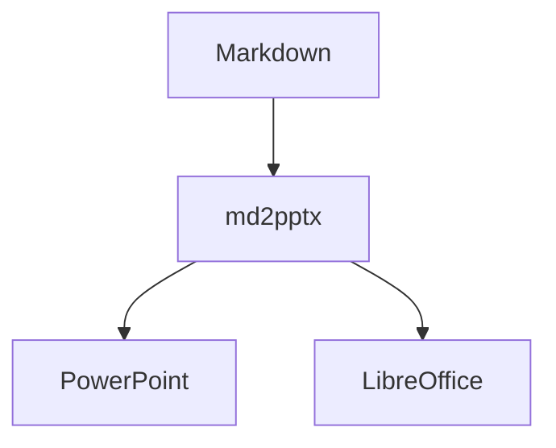
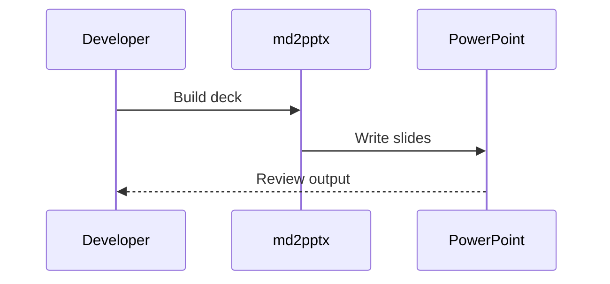
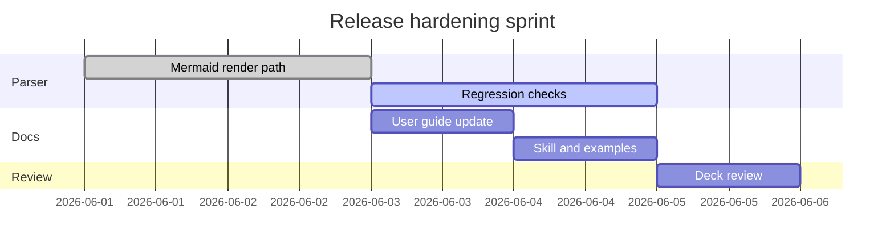

template: Martin Template.pptx
mermaidPngWidth: 1600
mermaidFlowchartHtmlLabels: no

# Mermaid Test
A focused Mermaid smoke test for md2pptx.

### Flowchart

```mermaid
graph TD
    Markdown[Markdown] --> Parser[md2pptx]
    Parser --> Deck[PowerPoint]
    Parser --> Review[LibreOffice]
```

### Sequence

```mermaid
sequenceDiagram
    participant Dev as Developer
    participant Tool as md2pptx
    participant PPT as PowerPoint
    Dev->>Tool: Build deck
    Tool->>PPT: Write slides
    PPT-->>Dev: Review output
```

### Gantt

```mermaid
gantt
    title Release hardening sprint
    dateFormat  YYYY-MM-DD
    section Parser
    Mermaid render path      :done, p1, 2026-06-01, 2d
    Regression checks        :active, p2, after p1, 2d
    section Docs
    User guide update        :p3, 2026-06-03, 1d
    Skill and examples       :p4, after p3, 1d
    section Review
    Deck review              :p5, 2026-06-05, 1d
```
