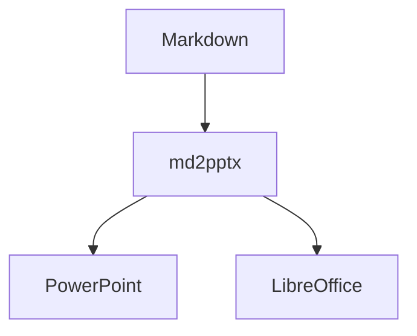
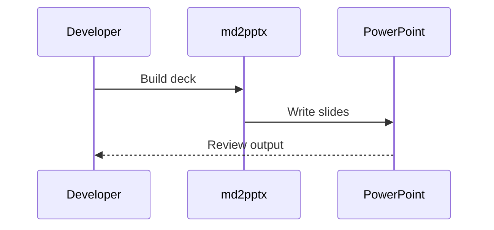

template: Martin Template.pptx

# Mermaid Test
A focused Mermaid smoke test for md2pptx.

### Flowchart

```mermaid
graph TD
    Markdown[Markdown] --> Parser[md2pptx]
    Parser --> Deck[PowerPoint]
    Parser --> Review[LibreOffice]
```

### Sequence

```mermaid
sequenceDiagram
    participant Dev as Developer
    participant Tool as md2pptx
    participant PPT as PowerPoint
    Dev->>Tool: Build deck
    Tool->>PPT: Write slides
    PPT-->>Dev: Review output
```
